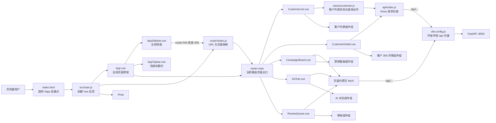
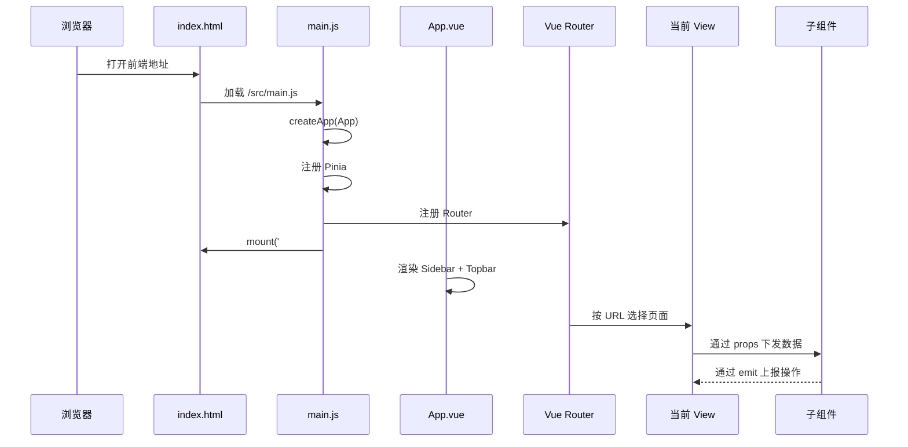
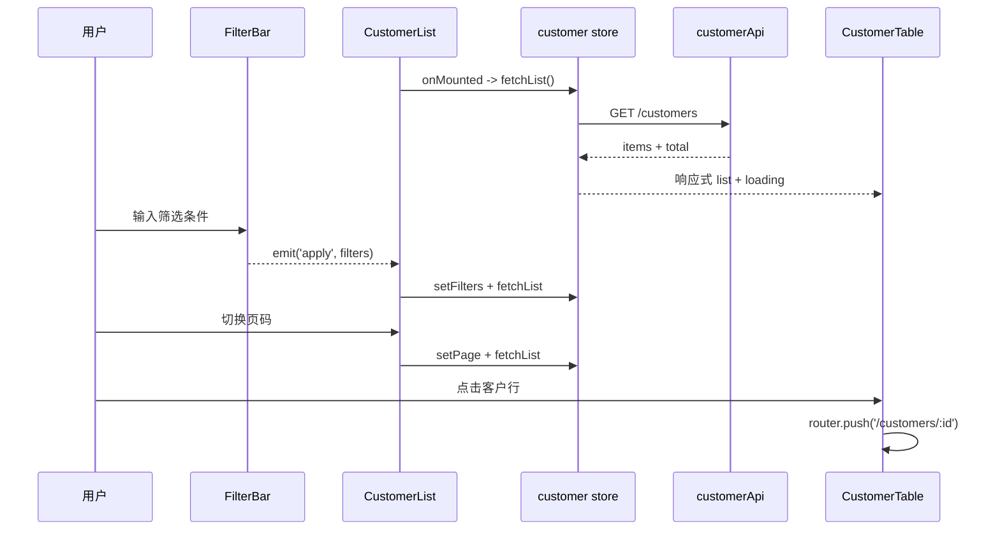
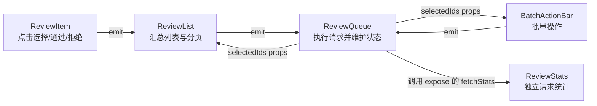
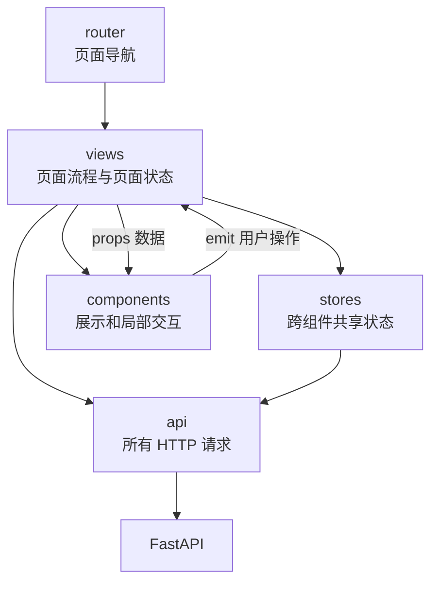

# Frontend 前端实现原理与文件说明

> 分析范围：`frontend/` 当前源码。本文只解释前端，不展开 FastAPI 内部实现。

## 1. 一张图看懂前端

核心理解：

1. `index.html` 只提供容器，`main.js` 才是真正的前端启动入口。
2. `App.vue` 是所有页面共同使用的外壳，负责侧边栏、顶部栏和页面内容区。
3. `router/index.js` 根据 URL 决定 `router-view` 中显示哪个 `views/*.vue`。
4. `views/` 是页面级组件，负责组织业务流程、请求数据、维护页面状态。
5. `components/` 是页面内部的展示或交互模块，主要通过 `props` 接收数据、通过 `emit` 把事件交回父组件。
6. 目前请求层没有完全统一：客户模块主要使用 `api/index.js`，营销、AI 和审核页面仍直接调用 `fetch`。
7. 开发环境下浏览器访问 `/api/...`，Vite 将请求转发到 `http://127.0.0.1:8000`。

## 2. 启动、渲染和路由原理

路由对应关系：

| URL | 页面文件 | 作用 |
|---|---|---|
| `/` | 重定向 | 自动跳到 `/customers` |
| `/customers` | `views/CustomerList.vue` | 客户查询、筛选、分页和导出 |
| `/customers/:id` | `views/CustomerDetail.vue` | 单个客户的 360 详情 |
| `/campaign` | `views/CampaignBoard.vue` | 营销 KPI、漏斗、渠道、内容效果 |
| `/ai-chat` | `views/AiChat.vue` | 自然语言查询客户 |
| `/review` | `views/ReviewQueue.vue` | 去重任务、审核和批量处理 |

所有页面均为路由懒加载；只有进入对应 URL 时才下载页面代码。客户详情中的四个较重 Tab 还进行了第二层异步加载。

## 3. 页面与组件树

```mermaid
flowchart TB
    APP[App.vue]
    APP --> SIDE[layout/AppSidebar.vue]
    APP --> TOP[layout/AppTopbar.vue]
    APP --> VIEW[router-view]

    VIEW --> CL[views/CustomerList.vue]
    CL --> FB[customer/FilterBar.vue]
    CL --> CT[customer/CustomerTable.vue]
    CL --> EB[customer/ExportButton.vue]

    VIEW --> CD[views/CustomerDetail.vue]
    CD --> OT[detail/OverviewTab.vue]
    OT --> KPI[detail/KpiCards.vue]
    OT --> PROFILE[detail/CustomerProfile.vue]
    OT --> TAGS[detail/BusinessTags.vue]
    OT --> FOLLOW[detail/FollowupStatus.vue]
    OT --> BUDGET[detail/OpportunityBudget.vue]
    OT --> TIMELINE[detail/BehaviorTimeline.vue]
    OT --> INSIGHT[detail/AiInsight.vue]
    CD --> CONTACTS[detail/ContactsTab.vue]
    CONTACTS --> PRIORITY[detail/AiPriorityContact.vue]
    CONTACTS --> CARD[detail/ContactCard.vue]
    CD --> BUSINESS[detail/BusinessFunnelTab.vue]
    CD --> OUTPUT[detail/BudgetOutputTab.vue]
    CD --> RISK[detail/RiskComplianceTab.vue]
    CD --> OPPS[detail/OpportunitiesTab.vue]
    BUSINESS --> CHART[detail/PrototypeChart.vue]
    OUTPUT --> CHART
    OPPS --> CHART

    VIEW --> CB[views/CampaignBoard.vue]
    CB --> CK[campaign/CampaignKpis.vue]
    CB --> FC[campaign/FunnelChart.vue]
    CB --> CP[campaign/ChannelPie.vue]
    CB --> RCC[campaign/RoleCoverageChart.vue]
    CB --> CET[campaign/ContentEffectTable.vue]
    CB --> CFT[campaign/CustomerFollowupTable.vue]

    VIEW --> AI[views/AiChat.vue]
    AI --> THREAD[ai/ChatThread.vue]
    THREAD --> ENTITY[ai/EntityChips.vue]
    AI --> RESULT[ai/QueryResultTable.vue]

    VIEW --> RQ[views/ReviewQueue.vue]
    RQ --> STATS[review/ReviewStats.vue]
    RQ --> BATCH[review/BatchActionBar.vue]
    RQ --> LIST[review/ReviewList.vue]
    LIST --> ITEM[review/ReviewItem.vue]
```

## 4. 五个页面的前端逻辑

### 4.1 客户列表

数据流：

- 页面状态集中在 `stores/customer.js`：列表、总数、加载状态、筛选条件和页码。
- `FilterBar` 自己请求行业、负责人下拉选项，但真正的列表查询由页面交给 store 执行。
- `CustomerTable` 只展示数据和执行详情页跳转，不直接查询后端。
- `ExportButton` 是少数直接调用 API 的列表子组件，负责生成 Blob 下载链接。

### 4.2 客户 360 详情

进入页面后，`CustomerDetail.vue` 使用 `Promise.allSettled` 并行请求：

- 客户基本信息；
- 联系人；
- 互动记录；
- 商机；
- AI 洞察。

即使其中某个接口失败，其余成功数据仍然可以显示。优先联系人接口随后单独异步请求，不阻塞主页面结束加载。

Tab 数据状态：

| Tab | 当前数据来源 | 实现状态 |
|---|---|---|
| 概览 | 客户、互动、商机、AI 洞察接口 | 已接真实数据 |
| 联系人 | 联系人、优先联系人接口 | 已接真实数据，并支持前端搜索和角色筛选 |
| 经营&漏斗 | 无 props、无接口 | 原型占位，图表值固定为 0 |
| 预算&产出 | 无 props、无接口 | 原型占位，图表值固定为 0 |
| 风险&合规 | 无 props、无接口 | 静态占位 |
| 商机 | 页面虽请求了商机，但未传给该 Tab | 当前仍是静态占位 |

### 4.3 营销看板

`CampaignBoard.vue` 在挂载和点击刷新时依次请求 6 个接口，然后将结果分别传给 6 个展示组件。

- 子组件不请求后端，只根据 `props.data` 渲染。
- `CustomerFollowupTable` 在浏览器内进行阶段筛选，最多显示 20 条。
- 请求异常进入 `catch` 时使用页面内置 Mock 数据。
- 当前日期下拉框没有绑定查询参数，只是视觉控件。
- 6 个请求当前串行执行，可改为 `Promise.allSettled` 并行。

### 4.4 AI 对话

`AiChat.vue` 管理消息、输入、加载状态和当前查询结果：

1. 用户输入问题；
2. 页面将用户消息放入 `messages`；
3. `POST /api/ai/chat`；
4. 将后端回复放入聊天线程；
5. 将客户结果传给 `QueryResultTable`；
6. 点击结果行跳转客户详情；
7. 点击导出调用 `/api/ai/chat/export` 并下载 Excel。

`QueryResultTable` 会发出分页事件，但父页面目前只打印页码，没有重新请求，因此 AI 查询结果分页尚未真正实现。

### 4.5 去重审核

`ReviewQueue.vue` 是前端逻辑最集中的页面：

- 查询审核列表并维护筛选、分页、选择状态；
- 单条通过/拒绝；
- 批量通过/拒绝；
- 启动去重任务；
- 每秒轮询去重进度；
- 任务完成后刷新列表和统计；
- 页面销毁时清理轮询定时器。

组件事件链：

## 5. 哪些文件显示内容，哪些文件调用接口

### 5.1 直接调用后端的文件

| 文件 | 调用方式 | 接口 |
|---|---|---|
| `src/api/index.js` | Axios 统一封装 | 定义全部客户、营销、AI、审核、ETL API |
| `src/stores/customer.js` | `customerApi` | 客户列表、客户详情 |
| `views/CustomerDetail.vue` | `customerApi` | 详情、联系人、互动、商机、AI 洞察、优先联系人 |
| `components/customer/FilterBar.vue` | `customerApi` | 筛选选项 |
| `components/customer/ExportButton.vue` | `customerApi` | 客户列表导出 |
| `views/CampaignBoard.vue` | 原生 `fetch` | 6 个营销看板接口 |
| `views/AiChat.vue` | 原生 `fetch` | AI 对话、对话结果导出 |
| `views/ReviewQueue.vue` | 原生 `fetch` | 列表、去重任务、进度、通过、拒绝、批量操作 |
| `components/review/ReviewStats.vue` | 原生 `fetch` | 审核统计 |

其余 Vue 文件当前都是纯展示、前端计算、事件转发或路由导航，不直接访问后端。

### 5.2 完整接口表

| 前端定义/调用 | 方法 | 路径 | 当前调用方 |
|---|---:|---|---|
| `customerApi.list` | GET | `/api/customers` | `stores/customer.js` |
| `customerApi.get` | GET | `/api/customers/:id` | `CustomerDetail.vue`、store 中未被页面使用的 `fetchDetail` |
| `customerApi.contacts` | GET | `/api/customers/:id/contacts` | `CustomerDetail.vue` |
| `customerApi.interactions` | GET | `/api/customers/:id/interactions` | `CustomerDetail.vue` |
| `customerApi.opportunities` | GET | `/api/customers/:id/opportunities` | `CustomerDetail.vue` |
| `customerApi.aiInsight` | GET | `/api/customers/:id/ai-insight` | `CustomerDetail.vue` |
| `customerApi.priorityContact` | GET | `/api/customers/:id/priority-contact` | `CustomerDetail.vue` |
| `customerApi.filterOptions` | GET | `/api/customers/filter-options` | `FilterBar.vue` |
| `customerApi.export` | GET | `/api/customers/export` | `ExportButton.vue` |
| 营销 KPI | GET | `/api/campaign/kpis` | `CampaignBoard.vue` |
| 漏斗分布 | GET | `/api/campaign/funnel-distribution` | `CampaignBoard.vue` |
| 渠道分布 | GET | `/api/campaign/channel-distribution` | `CampaignBoard.vue` |
| 角色覆盖 | GET | `/api/campaign/role-coverage` | `CampaignBoard.vue` |
| 内容效果 | GET | `/api/campaign/content-effect` | `CampaignBoard.vue` |
| 阶段客户 | GET | `/api/campaign/customers-by-stage` | `CampaignBoard.vue` |
| AI 对话 | POST | `/api/ai/chat` | `AiChat.vue` |
| AI 导出 | POST | `/api/ai/chat/export` | `AiChat.vue` |
| 审核列表 | GET | `/api/review` | `ReviewQueue.vue` |
| 审核统计 | GET | `/api/review/stats` | `ReviewStats.vue` |
| 单条通过 | POST | `/api/review/:id/approve` | `ReviewQueue.vue` |
| 单条拒绝 | POST | `/api/review/:id/reject` | `ReviewQueue.vue` |
| 批量通过 | POST | `/api/review/batch-approve` | `ReviewQueue.vue` |
| 批量拒绝 | POST | `/api/review/batch-reject` | `ReviewQueue.vue` |
| 启动去重 | POST | `/api/review/run-dedup` | `ReviewQueue.vue` |
| 去重进度 | GET | `/api/review/dedup-progress` | `ReviewQueue.vue` 每秒轮询 |

`api/index.js` 中已定义但当前页面没有使用的封装：

- `campaignApi` 全部方法；
- `aiApi.parse`、`aiApi.chat`、`aiApi.chatExport`；
- `reviewApi` 全部方法；
- `adminApi.runEtl`；
- store 的 `fetchDetail()`。

这说明项目正在从“页面直接 fetch”向“统一 API 层”迁移，但尚未完成。

## 6. frontend 每个文件是干什么的

### 6.1 根目录和构建文件

| 文件/目录 | 职责 |
|---|---|
| `frontend/package.json` | 定义 Vue、Router、Pinia、Axios、ECharts、Tailwind、Vite 依赖和启动命令 |
| `frontend/package-lock.json` | 锁定依赖的精确版本，自动生成，不包含业务逻辑 |
| `frontend/vite.config.js` | 注册 Vue/Tailwind 插件；开发端口为 3000；把 `/api` 代理到 FastAPI 8000 |
| `frontend/index.html` | HTML 壳，提供 `
`，加载 `src/main.js` |
| `frontend/README.md` | 前端项目说明文件 |
| `frontend/dist/` | `npm run build` 生成的生产静态文件，不应手工维护 |
| `frontend/node_modules/` | 安装的第三方依赖，不属于项目源码 |

### 6.2 应用入口、路由、状态和请求

| 文件 | 职责 |
|---|---|
| `src/main.js` | 创建 Vue App，注册 Pinia、Router、全局样式并挂载 |
| `src/App.vue` | 全局布局：侧边栏、顶部栏、页面内容出口 |
| `src/router/index.js` | 定义 5 个业务路由和默认重定向 |
| `src/stores/customer.js` | 客户列表的 Pinia store；筛选、分页、加载、查询动作 |
| `src/api/index.js` | Axios 实例、超时、JSON 请求头、响应解包、业务 API 方法 |
| `src/styles/main.css` | 当前实际生效的全局 Tailwind、主题变量和详情原型样式 |
| `src/style.css` | Vite 初始模板遗留样式，当前未被 `main.js` 引入 |

### 6.3 页面文件 `src/views`

| 文件 | 职责 |
|---|---|
| `CustomerList.vue` | 组织筛选、列表、导出、分页；通过 store 查询 |
| `CustomerDetail.vue` | 根据路由客户 ID 并行加载详情数据；管理 6 个 Tab |
| `CampaignBoard.vue` | 请求 6 组营销数据并分发给看板组件；失败时使用 Mock |
| `AiChat.vue` | 管理对话消息、自然语言查询、结果表、导出和详情跳转 |
| `ReviewQueue.vue` | 管理审核列表、筛选、分页、选择、批量动作和去重轮询 |

### 6.4 布局组件 `src/components/layout`

| 文件 | 职责 |
|---|---|
| `AppSidebar.vue` | 业务导航；根据当前路由高亮菜单 |
| `AppTopbar.vue` | 根据当前路由显示页面标题；通知和新建按钮目前无点击逻辑 |

### 6.5 客户列表组件 `src/components/customer`

| 文件 | 类型 | 职责 |
|---|---|---|
| `FilterBar.vue` | 交互 + API | 获取筛选选项；收集输入；`emit('apply')` |
| `CustomerTable.vue` | 展示 + 路由 | 显示加载、空状态和客户行；点击进入详情 |
| `ExportButton.vue` | 交互 + API | 按当前筛选导出 Excel |

### 6.6 客户详情组件 `src/components/detail`

| 文件 | 职责 |
|---|---|
| `OverviewTab.vue` | 概览组合容器，把客户数据分发给 7 个小组件 |
| `KpiCards.vue` | 展示意向、互动、采购阶段、角色覆盖、商机数 |
| `CustomerProfile.vue` | 展示行业、区域、负责人、地址、存量客户状态 |
| `BusinessTags.vue` | 标准化数组/JSON/逗号字符串并显示业务标签 |
| `FollowupStatus.vue` | 格式化最近互动时间和偏好渠道 |
| `OpportunityBudget.vue` | 展示漏斗数、最高阶段、成交金额并格式化金额 |
| `BehaviorTimeline.vue` | 展示互动时间线，格式化时间和渠道名称 |
| `AiInsight.vue` | 展示业务结论、重点联系人和证据链 |
| `ContactsTab.vue` | 联系人页容器；姓名/手机号搜索和角色筛选 |
| `AiPriorityContact.vue` | 展示 AI/规则推荐的优先联系人 |
| `ContactCard.vue` | 展示单个联系人信息、角色和活跃度 |
| `BusinessFunnelTab.vue` | 经营健康度与漏斗原型；当前无真实数据 |
| `BudgetOutputTab.vue` | 预算与产出原型；当前无真实数据 |
| `RiskComplianceTab.vue` | 风险合规原型；当前为固定占位内容 |
| `OpportunitiesTab.vue` | 商机分析原型；当前未接收到已请求的商机数据 |
| `PrototypeChart.vue` | ECharts 通用原型图；支持雷达、堆叠、条形三种类型，当前数据值固定为 0 |

### 6.7 营销组件 `src/components/campaign`

| 文件 | 职责 |
|---|---|
| `CampaignKpis.vue` | 将 KPI 数据转换成 5 张指标卡；趋势值目前是固定常量 |
| `FunnelChart.vue` | 根据阶段百分比计算漏斗宽度 |
| `ChannelPie.vue` | 使用 CSS 圆锥渐变显示渠道占比，并列出渠道数据 |
| `RoleCoverageChart.vue` | 显示负责人覆盖、互动和商机价值 |
| `ContentEffectTable.vue` | 显示各渠道互动、客户、点击、打开、下载和点击率 |
| `CustomerFollowupTable.vue` | 在前端按阶段筛选客户，最多展示 20 条 |

### 6.8 AI 组件 `src/components/ai`

| 文件 | 职责 |
|---|---|
| `ChatThread.vue` | 显示用户/助手消息、加载动画和实体标签 |
| `EntityChips.vue` | 过滤允许展示的解析实体并转换中文名称 |
| `QueryResultTable.vue` | 显示 AI 查询客户结果；向父页面发出导出、分页、行点击事件 |

### 6.9 审核组件 `src/components/review`

| 文件 | 职责 |
|---|---|
| `ReviewStats.vue` | 独立获取审核统计，并向父组件暴露 `fetchStats()` |
| `BatchActionBar.vue` | 显示已选数量，向父页面发出批量通过/拒绝/清空事件 |
| `ReviewList.vue` | 组织审核项、全选和分页，继续向父页面转发事件 |
| `ReviewItem.vue` | 显示一组候选数据、匹配分、状态和单条操作 |

### 6.10 静态资源和遗留文件

| 文件 | 当前状态 |
|---|---|
| `public/favicon.svg` | `index.html` 正在使用的网站图标 |
| `public/icons.svg` | 仅被未使用的 `HelloWorld.vue` 引用 |
| `src/assets/vite.svg` | 仅被未使用的 `HelloWorld.vue` 引用 |
| `src/assets/vue.svg` | 仅被未使用的 `HelloWorld.vue` 引用 |
| `src/assets/hero.png` | 仅被未使用的 `HelloWorld.vue` 引用 |
| `src/components/HelloWorld.vue` | Vite 模板遗留组件，未被当前应用引用 |

## 7. 当前架构中最值得注意的点

1. **请求层重复**：`api/index.js` 已经封装营销、AI、审核 API，但对应页面仍直接 `fetch`，导致错误处理、超时、响应解包和 Blob 下载逻辑不统一。
2. **详情页存在“已请求但未展示”**：商机接口结果传给了概览 KPI，却没有传给 `OpportunitiesTab`。
3. **多个详情 Tab 是原型，不是数据驱动页面**：经营、预算、风险、商机分析仍固定显示 0 或空数据。
4. **营销失败回退并不覆盖 HTTP 非 2xx**：代码只在 `fetch` 抛异常时执行 Mock；普通 4xx/5xx 不一定进入 `catch`，可能保留空数据。
5. **营销请求串行**：六个互不依赖的请求逐个等待，首屏时间是六次耗时叠加。
6. **AI 分页未完成**：结果表会抛出分页事件，父组件没有携带页码重新请求。
7. **顶部操作按钮是静态按钮**：通知、新建没有事件。
8. **遗留模板可清理**：`HelloWorld.vue`、`src/style.css` 及其三张图片当前不参与应用运行。
9. **状态管理范围较窄**：Pinia 目前只覆盖客户列表，其余页面都在页面组件内部维护状态；这本身可行，但风格不统一。
10. **TypeScript 使用不统一**：部分 `.vue` 使用 `lang="ts"`，入口、store、API 和其他页面仍是 JavaScript。

## 8. 建议的统一前端分层

建议规则：

- 页面和 store 可以调用 `api/`；
- 普通展示组件不直接访问后端；
- 文件下载等高度内聚的动作可以保留在专用组件中；
- 所有 `fetch` 迁入 `api/index.js`，统一错误、超时和返回值处理；
- 原型 Tab 接入真实接口后再给 `PrototypeChart` 传入 series 数据，而不是在图表组件里固定为 0。

