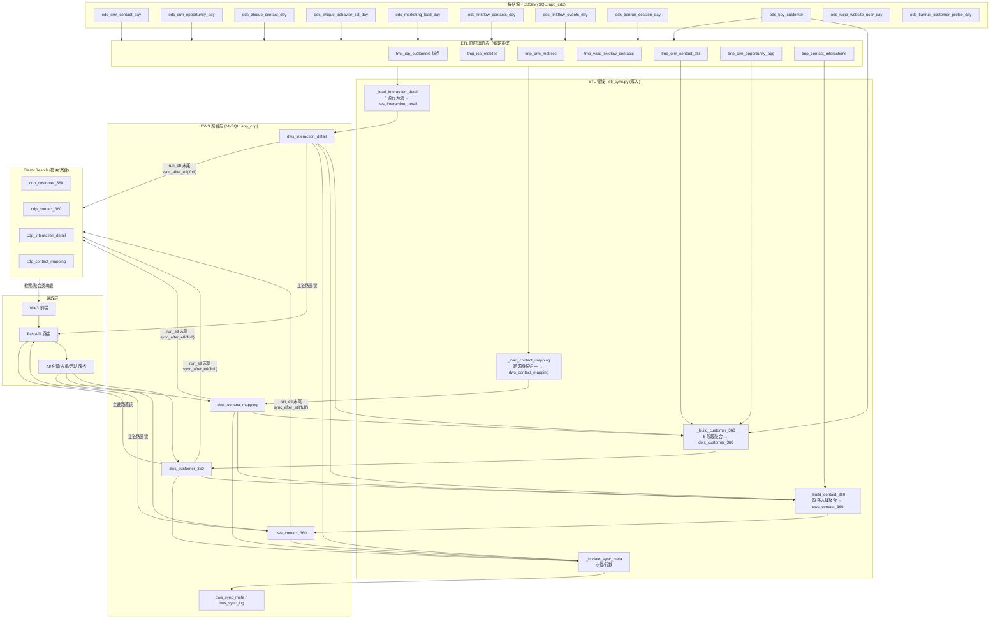

# ruijie-cdp 数据流解读

> 范围：ruijie-cdp 后端 ETL 管线（ODS → DWS → ES → 读取层）以及相关增值服务。
> 代码依据：`backend/app/services/etl/etl_sync.py`、`app/services/elasticSearch/es_sync.py`、各 `routers/*`、`frontend/src/api`。

---

## 一、整体架构：三层 + 一条写入管线



**核心结论先讲**：所有 ODS 原始表都**不直接**进 DWS，而是先经过一层 ETL 自有的**临时辅助表**（锚点 / 白名单 / 预聚合），再分别写入 4 张 DWS 表。DWS 表之间**严格分阶段串行写入**——`dws_contact_mapping` 与 `dws_interaction_detail` 先写，二者是 `dws_customer_360` 的输入；`dws_customer_360` 又是 `dws_contact_360` 的输入。同一张表内部，多个数据源是 `TRUNCATE` 后依次 `INSERT IGNORE` 做**并集叠加**（不是并行、也不是按主键 merge）。

---

## 二、写入管线（ODS → DWS）—— 详细拆解

### 2.1 两个入口，逻辑略有差异

| 入口函数 | 触发方 | 是否构建临时辅助表 | 备注 |
|---|---|---|---|
| `run_etl()` | 小时调度 + `POST /api/admin/etl/run` | **否**（直接跑 6 步） | 收尾调 `es_sync.sync_after_etl("full")` |
| `run_full_sync()` | `POST /api/admin/etl/full` | **是**（完整构建全部 tmp 表） | 带 `dws_sync_log`、批次号 |
| `run_incremental_sync()` | `POST /api/admin/etl/increment` | **是** | 带水位删除检测 |

> ⚠️ **重要差异（易踩坑）**：`run_etl` 本身**不调用** `_build_tmp_icp_customers / _build_tmp_crm_mobiles / _build_tmp_valid_linkflow_contacts / _build_tmp_crm_aggregates` 等辅助表构建函数。而这些临时表被 `_load_contact_mapping`、`_build_customer_360` 直接依赖（CRM/Linkflow 匹配、CRM 属性/商机预聚合都靠它们）。
> 因此：**必须先用 `run_full_sync` 或 `run_incremental_sync` 跑过一轮**，临时表才会存在；若只触发 `run_etl` 而此前从未跑过全量/增量同步，相关临时表为空，会导致 CRM/Linkflow 联系人匹配、CRM 属性/商机指标全部落空。V2 路径（`run_full_sync`/`run_incremental_sync`）才是完整、自洽的入口。

下文按 **V2 `run_full_sync` 的完整顺序**描述（这也是 `run_etl` 假定前置已具备的状态）。

### 2.2 阶段 0：建索引（`_create_indexes`）

对 ODS 与 DWS 表按需建索引，纯为 join/分组提速，不改变数据：
- ODS：`ods_crm_contact_day(mobile)`、`ods_linkflow_contacts_day(contact_id)`、`ods_linkflow_events_day(contact_id)`、`ods_zhique_behavior_list_day(mobile_phone)`、`ods_tianrun_session_day(visitor_id / customer_name)`。
- 聚合分组提速：`ods_crm_contact_day(customer_name)`、`ods_crm_opportunity_day(customer_name)`、`ods_zhique_contact_day(related_company / mobile)`、`dws_interaction_detail(contact_name, mobile)`。

### 2.3 阶段 1：构建 ETL 临时辅助表（锚点 + 预聚合）

这是整个管线的"地基"，全部建在内存/会话临时表，每轮 `_create_etl_temp_tables()` 先 `DROP` 再 `CREATE`，跑完 `finally` 中清理。

| 临时表 | 来源 / 构建逻辑 | 服务谁 |
|---|---|---|
| `tmp_icp_customers` | `SELECT DISTINCT related_company FROM ods_zhique_contact_day`（非空）。**ICP 客户锚点 = 智渠联系人表里出现过的全部公司名**，是后续所有"公司是否合法"判断的基准白名单。 | contact_mapping 过滤、interaction 过滤、customer_360 主键、contact_360 过滤 |
| `tmp_icp_mobiles` | `SELECT DISTINCT mobile FROM ods_zhique_contact_day`（非空）。ICP 客户对应的手机号集合。 | CRM 联系人"按手机号命中 ICP"判断 |
| `tmp_crm_mobiles` | `SELECT DISTINCT mobile FROM ods_crm_contact_day`（非空且有公司名）。保留"知渠行为手机号命中 CRM"的原始语义。 | 驱动知渠行为写入 interaction（用 mobile 索引避免全表扫） |
| `tmp_valid_linkflow_contacts` | `ods_linkflow_contacts_day l INNER JOIN ods_crm_contact_day crm ON l.mobile_phone = crm.mobile`（COLLATE 统一）。即**只用手机号能匹配上 CRM 的 Linkflow 联系人**，并顺带带上 `crm.customer_name`。 | Linkflow 联系人/事件 → 公司名对齐 |
| `tmp_crm_contact_attr` | 对 `ods_crm_contact_day` 按 `customer_name` 预聚合：`industry=MAX(industry)`、`region=MAX(ruijie_region)`、`owner_name=MAX(sales_name)`、`attribute=MAX(attribute)`、`contact_count=COUNT(DISTINCT contact_name)`、`mobile_count=COUNT(DISTINCT mobile)`。 | customer_360 Phase2 |
| `tmp_crm_opportunity_agg` | 对 `ods_crm_opportunity_day` 按 `customer_name` 预聚合：`purchase_stage=MAX(customer_stage)`、`forecast_type=MAX(forecast_type)`、`active_opp_count / active_opp_amount`（按 `is_active=1` 且 `amount_10k*10000` 求和）、`funnel_opp_count`（`is_funnel='是'`）、`won_amount`（按 `actual_order_amount_10k*10000` 求和）。 | customer_360 Phase3 |
| `tmp_contact_interactions` | 对 `dws_interaction_detail` 按 `(contact_name, mobile)` 聚合：`interaction_count`、`interaction_count_30d`、`last_interaction_time`。**依赖 interaction 表先写好**（阶段 2 之后才建）。 | contact_360 |

### 2.4 阶段 2：dws_contact_mapping（身份归一）

**写入方式**：`TRUNCATE dws_contact_mapping` 后，按 **5 个数据源依次 `INSERT IGNORE` 叠加**（并集），每张源表一条 SQL。靠 `INSERT IGNORE` + 后续唯一约束去重；主键是自增 id，没有业务唯一键。

**5 个数据源与字段映射 / 关联逻辑**：

1. **智渠（BASE/锚点，约 2.4K ICP 客户）** — `FROM ods_zhique_contact_day`（只要 `related_company` 非空）。
   - `customer_name = related_company`，`contact_name / mobile / email / department / position` 直取，`source_table='zhique'`。
   - 这是整个映射的**基准锚点**：后续 CRM/Linkflow 能否进入映射，都看是否匹配到这张表的公司名或手机号。
2. **CRM 联系人（仅命中智渠的）** — `FROM ods_crm_contact_day`，**过滤条件 = `customer_name IN tmp_icp_customers OR mobile IN tmp_icp_mobiles`**（即"公司名在智渠客户里，或手机号在智渠手机号里"）。
   - `customer_name / contact_name / mobile / email / department / position` 直取；`purchase_role` 经 `ROLE_MAP` 映射成 `role_category`（如 `拍板者/决策者→决策者`、`评估者→技术评估者`、`使用者→使用者`），`source_table='crm'`。
3. **营销线索** — `FROM ods_marketing_lead_day`，`company = COALESCE(final_company_name, customer_company, opp_customer_name)`（三字段兜底取第一个非空），`contact_name / contact_phone→mobile / email / lead_function→position`，`source_table='marketing'`；`SELECT DISTINCT` 防重复。**此源不过滤 ICP**（营销线索公司名可能不在智渠白名单内）。
4. **Linkflow 联系人** — 驱动表是 `tmp_valid_linkflow_contacts`（= 手机号能匹配 CRM 的 Linkflow 联系人），再 `INNER JOIN ods_linkflow_contacts_day` 取 `email`。
   - `customer_name` 直接取 CRM 匹配到的公司名、`contact_name=name`、`mobile=mobile_phone`、`linkflow_contact_id=contact_id`，`source_table='linkflow'`。**关联关键 = 手机号对齐 CRM**。
5. **天润（会话来源）** — `FROM ods_tianrun_session_day`（`customer_name` 与 `visitor_name` 均非空）。
   - `customer_name` 直取、`contact_name = visitor_name`，`source_table='tianrun'`。**注意：天润无手机号；其 `customer_name` 实际是地域/访客标签（如"江苏徐州3e9a6c""网页1a6353"），并非真实公司名，属于低质量匹配。**

### 2.5 阶段 3：dws_interaction_detail（统一行为流）

**写入方式**：`TRUNCATE dws_interaction_detail` 后，按 **5 个行为源依次 `INSERT IGNORE` 叠加**。去重键 = `(source_table, source_id)`（`source_id` 对知渠/天润/Linkflow 用各自原始 id，对 CRM 线索/商机用行内容 MD5 哈希），保证重跑幂等。

| 行为源 | 来源表 | 关联 / 过滤逻辑 | 关键字段映射 |
|---|---|---|---|
| 知渠行为 | `ods_zhique_behavior_list_day` | `INNER JOIN tmp_crm_mobiles`（按 `mobile_phone`）→ 命中 CRM 手机号；再 `INNER JOIN ods_crm_contact_day`（按 `mobile`）取**公司名**。`customer_name` 来自 CRM 联系人。 | `channel` 由 `behavior_type` 经 `ZHIQUE_CHANNEL_MAP` 映射（打开/点击邮件→`email`；报名会议/参会/观看直播→`event`；下载资料/表单/落地页→`web`）；`event_time=behavior_time`；`source_id=behavior_id` |
| 天润会话 | `ods_tianrun_session_day` | `INNER JOIN tmp_icp_customers`（按 `customer_name`）→ **只保留公司名命中 ICP 白名单的会话**，避免把地名/访客标签当公司名入库。`customer_name` 直取、`contact_name=visitor_name` | `channel` 由 `contact_type_name` 映射（`网页/百度营销→web`、`企微客服→wechat`）；`behavior_type=receive_type_name`（缺省 `online_chat`）；`event_time=FROM_UNIXTIME(start_time_sec)`；`is_high_value = total_duration>60`；`source_id=id` |
| Linkflow 事件 | `ods_linkflow_events_day` | `INNER JOIN tmp_valid_linkflow_contacts`（按 `contact_id`）→ 只取能对齐 CRM 的联系人事件。`customer_name` 来自 CRM 匹配 | `channel='web'`；`event_time=FROM_UNIXTIME(event_date_ms/1000)`；`interaction_content` = `props_json->$.s_term`（来源搜索词，JSON 解析，缺省空）；`source_id=event_id` |
| CRM 线索 | `ods_crm_lead_data_day`（整表扫，全量更新） | 一条线索 = 一次"线索获取"交互。`客户单位` 非空且 `线索获得日期` 非空 | `customer_name=客户单位`、`contact_name=客户姓名`、`mobile=联系电话`、`channel=线索来源大类`、`behavior_type='线索'`、`content=活动名称/线索来源类型`、`event_time=线索获得日期`；`source_id=MD5(线索编号+单位+姓名+电话+日期+活动)` |
| CRM 商机 | `ods_crm_opportunity_data_day`（整表扫，全量更新） | 一条商机 = 一次"商机创建"交互。`客户名` 非空且 `创建日期-转化` 非空 | `customer_name=客户名`、`contact_name=业务机会所有人名称`、`mobile=NULL`、`channel=商机来源`、`behavior_type='商机'`、`content=业务机会名称`、`event_time=创建日期-转化`；`source_id=MD5(业务机会编码+客户名+名称+日期+来源)` |

**顺序**：`zhique → tianrun → linkflow → crm_lead → crm_opportunity`（函数内 `_load_interaction_detail` 调用顺序）。

### 2.6 阶段 4：dws_customer_360（客户级聚合，5 阶段）

**写入方式**：`TRUNCATE` 后，**先 INSERT 打底，再 4 次 UPDATE 逐阶段富化**（不是一次性 SELECT 多表 JOIN）。依赖 `dws_interaction_detail` + `tmp_crm_contact_attr` + `tmp_crm_opportunity_agg` + `dws_contact_mapping` + `ods_key_customer`。

- **Phase1（INSERT 互动聚合）**：以 `tmp_icp_customers` 为左基，`LEFT JOIN dws_interaction_detail GROUP BY customer_name`，写入 `interaction_count_total`、`interaction_count_30d`（近 30 天）、`last_interaction_time`、`last_interaction_channel`、`top_channels`（各渠道 JSON 数组）。
- **Phase2（UPDATE 富化 CRM 联系人属性）**：`INNER JOIN tmp_crm_contact_attr` → `industry / region / owner_name / attribute / contact_count / mobile_count`。
- **Phase3（UPDATE 富化 CRM 商机指标）**：`INNER JOIN tmp_crm_opportunity_agg` → `purchase_stage / forecast_type / active_opp_count / active_opp_amount / funnel_opp_count / won_amount`。
- **Phase4（UPDATE 派生字段）**：
  - `role_coverage`（全/部分/无）：按 `dws_contact_mapping.role_category` 是否集齐 决策者+技术评估者+使用者。
  - `source_tables`：从 `dws_contact_mapping` 聚合出该客户出现的源 JSON 数组。
  - `data_coverage`（JSON）：`has_crm / has_opp / has_contacts / has_interactions` 布尔。
  - `intent_score` / `intent_level`：意向分 = `近30天互动*2 + (有活跃商机?20:0) + (联系人≥3?10:联系人*3)`，封顶 100；等级据互动数与商机数判 高/中/低/无。
- **Phase5（enrich/insert `ods_key_customer` 重要客户）**：
  - Step1 `UPDATE`：按 `key_customer_name = customer_name` 匹配，写入 `owner_name(←ods.customer_name)`、`region(←department_level3)`、`industry(←industry_category)`、`attribute(←attribute)`。
  - Step2 `INSERT IGNORE`：把 `ods_key_customer` 中存在、但 `dws_customer_360` 尚缺的客户补插入（以 `key_customer_name` 为准）。

### 2.7 阶段 5：dws_contact_360（联系人级聚合）

**写入方式**：`TRUNCATE` 后，先建 `tmp_contact_interactions`（见 2.3），再一条 `INSERT IGNORE` 从 `dws_contact_mapping` 出发组装。

- 驱动：`dws_contact_mapping`（参数化表名，增量时可用 `*_temp` 基表保证结果一致）。
- `INNER JOIN tmp_icp_customers`（公司名必须在 ICP 白名单）→ 过滤掉无合法公司的孤儿联系人。
- `LEFT JOIN dws_customer_360` 取 `customer_id`；要求 `c360.id IS NOT NULL AND != 0`，**即只有能落到真实客户行上的联系人才能进 contact_360**（再次过滤孤儿）。
- `LEFT JOIN tmp_contact_interactions`（按 `contact_name, mobile` 精确匹配，含 `<=>` 处理 NULL）取 `interaction_count / _30d / last_interaction_time`。
- 写入字段：`customer_id / contact_name / mobile / email / department / position / purchase_role / role_category / 互动计数 / source_tables / linkflow_contact_id`。
- 末了 `UPDATE` 计算 `activity_level`（high/medium/low/none，按近 30 天互动阈值 10/3/1）。

### 2.8 阶段 6：dws_sync_meta（水位与行数）

`_update_sync_meta()` 遍历 `_ODS_TABLES`（共 10 张 ODS 源表），每张写/更新一行：`last_sync_time / last_run_time / rows_synced / status`。
- 对于已在 `ODS_INCREMENTAL_CONFIG` 中配置水位字段的表，这里把 `last_sync_time` 置为哨兵值 `'1970-01-01'`，**真实水位由 `_set_watermark_after_load` 单独维护**（避免用"现在"覆盖真实增量水位）。
- 其余表正常写 `last_sync_time = 本次运行时间`。

### 2.9 写入顺序 / 依赖关系（回答"依次还是并行"）

是**严格分阶段串行 + 表内多源并集叠加**，不是并行：

```
tmp 辅助表(锚点/白名单/预聚合)        ← 最先建，地基
   └─ dws_contact_mapping  (5 源 INSERT IGNORE 叠加)
   └─ dws_interaction_detail (5 源 INSERT IGNORE 叠加)   ┐ 二者无互相依赖，可视为同一批
                                                          │
   └─ dws_customer_360  (INSERT 互动 + 4×UPDATE 富化)  ← 依赖上面两张 + tmp 预聚合 + ods_key_customer
         └─ dws_contact_360  (依赖 dws_contact_mapping + dws_interaction_detail + dws_customer_360 + tmp_contact_interactions)
               └─ dws_sync_meta

末尾 try/except → es_sync.sync_after_etl("full")   ← best-effort，ES 失败不影响主流程
```

- **跨表依赖是单向有向的**：mapping/interaction 不依赖 360；customer_360 依赖 mapping+interaction；contact_360 依赖前三张全部。
- **同表内多源是顺序 `INSERT IGNORE` 并集**，源与源之间互不 merge，靠 `INSERT IGNORE` 跳过主键/唯一冲突；因此"同一联系人多源出现"会保留首条（`IGNORE`），后续源的重复行被丢弃。
- 全流程在一个事务外逐段提交（非单大事务），中途失败则已写部分保留、下一轮 `TRUNCATE` 重来，保证幂等。

---

## 三、DWS → ES 同步（es_sync.py）

- **做什么**：把 4 张 DWS 表同步到 ES 索引 `cdp_customer_360 / cdp_contact_360 / cdp_interaction_detail / cdp_contact_mapping`。
- **全量（alias 轮换）**：建带时间戳的物理索引 → 灌数据 → 把别名 `cdp_xxx` 原子切换到新索引 → 删旧索引。**零中断切换**，读流量不中断。
- **增量**：基于 `updated_at` 水位做 upsert；对 customer / contact 做**孤儿删除检测**（DWS 已删的客户/联系人在 ES 同步删掉）。
- **best-effort**：`run_etl` 里用 `try/except` 包住 `sync_after_etl`，**ES 挂了不影响主 ETL**，仅记 error 日志。
- **配置要点**（来自项目记忆，避免再踩坑）：集群 `k8s-bj-pro-nodeports.ruijie.com.cn:30589`，**HTTP 协议**（非 https），账号 `elastic`，服务端 8.7.1 → Python 客户端必须 `elasticsearch>=8.0,<9.0`；IK 分词 `ES_ANALYZER=ik_max_word`，无 IK 时改 `standard`。
- **管理端点**：`POST /api/admin/es/full`、`/increment`、`/health`，以及通用 CRUD/检索 `POST /api/admin/es/{index}/search`。

---

## 四、读取路径（前端怎么消费）

**主链路 = 前端 → FastAPI → MySQL DWS 直读**（已核实 `frontend/src/api/index.js` 调用的都是 `/api/customers/*`）：

| 功能 | 端点 | 直读哪张 DWS 表 / 回查 |
|---|---|---|
| 客户列表 | `GET /api/customers` | `dws_customer_360` + 关键客户表 |
| 客户明细 | `GET /api/customers/{id}` | `dws_customer_360`，并回查 `ods_crm_contact_day` 补拜访时间等原始信息 |
| 筛选选项 / 统计 | — | 直读 `dws_customer_360` / `dws_interaction_detail` |
| AI 优先联系人 | `GET /api/customers/{id}/priority-contact` | 规则评分（角色/活跃度/最近互动/完整度/意向）+ LLM 二次分析，源数据来自 `dws_contact_360` / `dws_interaction_detail` |
| 检索 / 聚合类功能 | `POST /api/admin/es/{index}/search` | **走 ES**（`CampaignBoard`、`ContactsTab`、`ReviewQueue` 等用 ES 检索），不是列表首页主数据源 |

> 关键：**ODS 原始表一般只在明细接口按需回查**，列表/统计/推荐等聚合场景一律消费 DWS。

---

## 五、围绕 DWS 的增值服务（不改变主数据流）

这些服务都**读** DWS（个别会**写**自己的业务表），但不参与 ODS→DWS 主链路：

- `company_dedup`（去重审核队列）：对 `dws_customer_360` 公司名做嵌入+相似度检索，疑似重复写入 `review_candidate` 表，由审核 API/前端 `ReviewQueue.vue` 处理批准/合并。
- `contact_recommend`（AI 优先联系人）：基于 `dws_contact_360` + `dws_interaction_detail` 评分，详见四-表格。
- `ai_chat`：对话问答，检索 DWS 上下文。
- `campaign`（活动看板）：读 DWS + ES 做活动效果聚合。
- `monitor`：监控指标，源数据来自 DWS 聚合结果。
- `customer_service`：客服场景读取客户 360 视图。

---

## 六、容易混淆的两点

1. **`run_etl` vs `run_full_sync`/`run_incremental_sync` 是两套入口**：小时调度只跑 `run_etl`（末尾顺带推 ES），但它**不构建临时辅助表**；带日志/水位、且完整构建 tmp 表的是 V2 的 `run_full_sync`/`run_incremental_sync`，由管理员手动触发。务必先跑一次 V2 全量，临时表才存在，否则 `run_etl` 的 CRM/Linkflow 匹配与 CRM 指标会失真。两者 DWS 表结构必须一致，否则会出现"列缺失/重复列"问题。
2. **ODS 与 DWS 在同一库 `app_cdp`**（不是 `ruijie-BI` 的 `app_bi`，那是另一个独立 BI 项目）。

---

## 附：dws_customer_360 字段级血缘速查

| dws_customer_360 字段 | 来源 |
|---|---|
| customer_name（主键） | `tmp_icp_customers` / `ods_zhique_contact_day.related_company` |
| interaction_count_total / _30d / last_interaction_time / last_interaction_channel / top_channels | `dws_interaction_detail`（按 customer_name 聚合） |
| industry / region / owner_name / attribute / contact_count / mobile_count | `ods_crm_contact_day`（预聚合于 `tmp_crm_contact_attr`） |
| purchase_stage / forecast_type / active_opp_count / active_opp_amount / funnel_opp_count / won_amount | `ods_crm_opportunity_day`（预聚合于 `tmp_crm_opportunity_agg`） |
| role_coverage / source_tables | `dws_contact_mapping`（按 customer_name 聚合） |
| data_coverage / intent_score / intent_level | 上述字段派生计算 |
| owner_name / region / industry / attribute（重要客户覆盖） | `ods_key_customer`（按 key_customer_name 匹配补充） |
